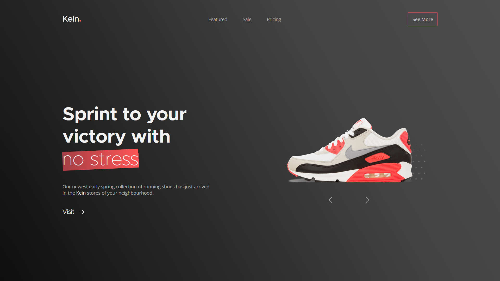

# Personal Project - Shoes Shop

## 📖 About

A hero section of a website for a fictional shoes shop called "Kein".

In this project, I:

- made use of JS modules
- utilized CSS custom properties to my advantage
- took in consideration smaller screen sizes

**`This project was made for educational purposes and is not affiliated by any means to the popular and well-known company Nike.`**

## 🖼️ [Live Preview Link](https://zascuofficial-kein.netlify.app/ "The live preview link")

## 💻 Technologies Used

